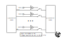

# lx-deciim

The lx-deciim is a unique 2-channel bitcrusher eurorack module. Conventionals bitcrushers reduce resolution of the input bit by bit starting by the LSB (Least Significant Bit).

The lx-deciim let you select which bit you want to disable. In addition, when a bit is disabled, it can be replaced by a CV input going through a trigger to get a clean '0' '1' value.

The trigger compares the input value against the CV to a reference voltate. This ref value can be set to either 0V or 2.5V from a jumper on the back of the module. In addition, you can also downsample the input signal.

The module is based on the Daisy Seed by Electrosmith.

## Concept

The concept of the module can be described by the following equation:

`audioOut = (audioIn & ~concatSwitch) + (concatTrigger & concatSwitch)`

Considering:

- `audioOut` : 12 bits binary audio output in (integer)
- `audioIn` : 12 bits binary audio input in (integer)
- `concatSwitch` : 12 bits binary value of the concatenation of the switches' value
- `concatTrigger` : 12 bits binary value of the concatenation of the input trigger value

## Bloc diagram

## Specification

- 12 bits 48kHz
- 12 CVs input to trigger audio-rate capable
- 2 inputs eurack level compatible +-5V
- 2 outputs eurack level compatible +-5V
- Downsampling from 48kHz to 1kHz
- Width: 12HP
- Power Consumptions +12V=80mA, -12V=2mA, +5V=0mA

## Repository content

- [Hardware](Hardware/): KiCad Project & Front Panel
  - [Hardware/lx-deciim/](Hardware/lx-deciim/): KiCad Project, Main PCB + Front Panel PCB
  - [Hardware/lx-deciim-front-panel/](Hardware/lx-deciim-front-panel/): SVG design of the front panel
- [Software](Software/): Main software & python script to generate front panel design
  - [Software/lx-deciim-libdaisy/](Software/lx-deciim-libdaisy/): Main software based on LibDaisy
  - [pattern_square_generator.py](Software/pattern_square_generator.py): Main software & python script to generate front panel design

## Hardware

The module consist of 2 PCBs. The main PCB (in reality two PCBs on a panel), and the front panel. The main PCB is really standard 2 layers PCB. After snapping the panel, you can assemble the two PCBs together with the help of male/female header. The front panel is a one layer PCB. I chose matte black solder mask, white silkscreen and ENIG finish on the copper.

All PCB shown in pictures in this repo are manufactured using [PCBWay](https://pcbway.com) services.

PCBWay provides high-quality PCB manufacturing with reliable service and fast turnaround times, making them my first choice for prototyping as seen in this project. They can also make more complex PCB to fit any of your requirements.

## License

This project is licensed under the [CC BY-NC 4.0](https://creativecommons.org/licenses/by-nc/4.0/) License. You may use, modify, and share it for non-commercial purposes.
